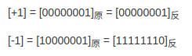
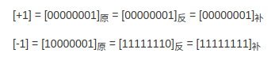
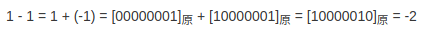
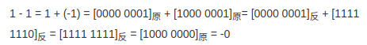
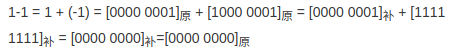
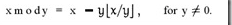
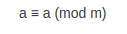
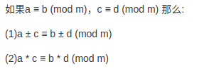
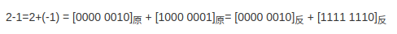

# ringBuf

该代码实现参考kfifo设计，下面主要对代码里的几处巧妙设计做一个简单的分析。

```
struct tagRingBuf{
    unsigned int  in;             //写索引
    unsigned int  out;             //读索引
    unsigned int  size;            //数据缓存区大小
    void   *buffer;          //数据缓存

    unsigned int (*get) (RingBuf *pObj, char *buf, unsigned int getSize);
    unsigned int (*put) (RingBuf *pObj, const char *buf, unsigned int bufSize);
};
```

1. size大小限定，必须是2的幂。

   ```
   if (bufSize & (bufSize - 1)) 
   {
    	/* 不是则向上扩展成2的幂 */
       bufSize = roundupOfTwo(bufSize);
   }
   ```

   为什么限定为2的幂，个人觉得有两大好处：

   * 保证in/out是size的整数倍 (size : 2^x in/out : 2^32)
   * 取模运算可以转换成与运算 in%size -> in&(size-1)

2. in/out利用unsigned int的溢出回绕特性。

   ```
   unsigned int part1 = 0;
   
   /* in-out 表示空间使用大小； size-(in-out)表示未使用空间大小 */
   bufSize = MIN(bufSize, pObj->size - pObj->in + pObj->out);
   
   /* size-in表示in到尾端的大小 */
   part1 = MIN(bufSize, pObj->size - (pObj->in & (pObj->size - 1)));
   
   memcpy(pObj->buffer + (pObj->in & (pObj->size - 1)), buf, part1);
   memcpy(pObj->buffer, buf + part1, bufSize - part1);
   
   pObj->in += bufSize;
   
   return bufSize;
   ```

   上面是put的代码，没有一句多余的代码。in/out回绕特性:`pObj->in += bufSize;`没有进行取模运行。

3. in - out 始终表示的是使用的空间大小，即使in回绕到前面时该公式依然成立。

   

   

   如上图所示，红的区域为使用空间大小，第一种 in - out表示红色区域长度，第二种如何理解？

   其实很好理解，**in - out =  in + (- out ) **; in就是第一段数据，-out是第二段数据。我们可以把环形缓存一个有size个刻度的表盘，顺时针转一个刻度表示+1,那么逆时针转一个刻度不久表示-1。上图中不就是逆时针拨了out个size吗？

补充：

原码：符号位加上真值的绝对值，即用第一位表示符号位，其余位表示值(原码是人脑最容易理解和计算的表示方式)。

8位二进制的取值范围：`[1111 1111, 0111 1111]` ->   [-127, 127]

反码：正数的反码是其本身;负数的反码是在源码的基础上，符号位不变，其余各个位取反。



补码：正数的补码是其本身;负数的补码在其原码的基础上，符号位不变，其余各位取反，最后+1(即在反码基础上加1)。




**在计算机系统中，数值一律用补码来表示和存储 。为什么在计算机中使用补码来表示？**

运算法则减去一个正数等于加上一个负数,而机器正是因为使用了补码，设计的只有加法而没有减法。

1-1=0使用三种不同的编码方式计算方法(符号位参与运算)：







使用原码和反码做减法运算时，不是存在数值问题，就是表示上存在问题。但是补码很好的解决类另外两个编码存在的问题。

取模运算是计算两数相除以后的余数。

同余：两个整数a，b，若它们除以整数m所得的余数相等，则称a，b对于模m同余。

负数取模：(x mod y 等于 x 减去 y 乘上 x与y的商的下界.)。负数取模，如果|x| < |y| ->   x mod y = y - |x|  

同余数的两个定理：

反身性：

线性运算定理：



利用上面的定理，我们可以为一个负数找到它的正数同余数，最终的计算出的余数相等。

2 - 1 = 1;   ->  (-1) mod 127 =126, 126 mod 127 = 126; -> 2-1 与 2+126的余数结果相同。

上面的结论我们无可否认，但是这又能说明什么呢？

让我们把2-1转换成8bit二进制来看一下（7bit能表示的最大值是127）：



如上图所示，-1的反码表示是1111 1110. 如果这里将[1111 1110]认为是原码, 则[1111 1110]原 = -126, 这里将符号位除去, 即认为是126, 而2+126很显然相当于钟表转过了一轮, 而因为符号位是参与计算的, 正好和溢出的最高位形成正确的运算结果.所以说一个数的反码, 实际上是这个数对于一个膜的同余数. 而这个膜就是所能表示的最大值。补码是在反码基础上加1的，所以模也应该相应加1。这样使用补码便可以蒋减法变加法。