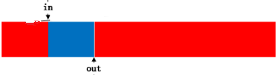

# ringBuf

该代码实现参考kfifo设计，下面主要对代码里的几处巧妙设计做一个简单的分析。

```
struct tagRingBuf{
    unsigned int  in;             //写索引
    unsigned int  out;             //读索引
    unsigned int  size;            //数据缓存区大小
    void   *buffer;          //数据缓存

    unsigned int (*get) (RingBuf *pObj, char *buf, unsigned int getSize);
    unsigned int (*put) (RingBuf *pObj, const char *buf, unsigned int bufSize);
};
```

1. size大小限定，必须是2的幂。

   ```
   if (bufSize & (bufSize - 1)) 
   {
    	/* 不是则向上扩展成2的幂 */
       bufSize = roundupOfTwo(bufSize);
   }
   ```

   为什么限定为2的幂，个人觉得有两大好处：

   * 保证in/out是size的整数倍 (size : 2^x in/out : 2^32)
   * 取模运算可以转换成与运算 in%size -> in&(size-1)

2. in/out利用unsigned int的溢出回绕特性。

   ```
   unsigned int part1 = 0;
   
   /* in-out 表示空间使用大小； size-(in-out)表示未使用空间大小 */
   bufSize = MIN(bufSize, pObj->size - pObj->in + pObj->out);
   
   /* size-in表示in到尾端的大小 */
   part1 = MIN(bufSize, pObj->size - (pObj->in & (pObj->size - 1)));
   
   memcpy(pObj->buffer + (pObj->in & (pObj->size - 1)), buf, part1);
   memcpy(pObj->buffer, buf + part1, bufSize - part1);
   
   pObj->in += bufSize;
   
   return bufSize;
   ```

   上面是put的代码，没有一句多余的代码。in/out回绕特性:`pObj->in += bufSize;`没有进行取模运行。

3. in - out 始终表示的是使用的空间大小，即使in回绕到前面时该公式依然成立。

   

   

   如上图所示，红的区域为使用空间大小，第一种 in - out表示红色区域长度，第二种如何理解？

   我的理解方式是从二进制入手，首先我们要知道一个计算机的基础知识，**在计算机系统中，数值一律用补码来表示和存储。整数的补码再求补码，等于该整数自身。**